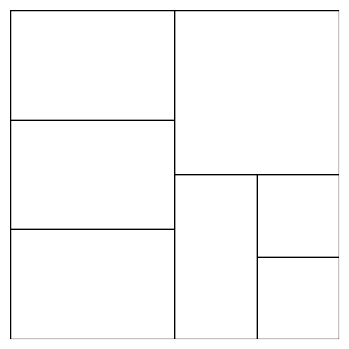
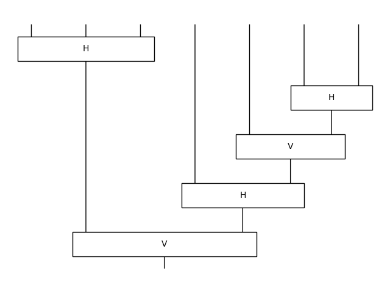

# tally

Tally is a tool for the quantum-enhanced composition of generative art.

See [Tally α](/tally-alpha.ipynb) for the notebook of our first experiment.

```python
from tally import H, V, e

composition = V(e, e, e) | e & H(e, e & e)

composition.draw()
```



```python
composition.to_diagram().draw()
```


