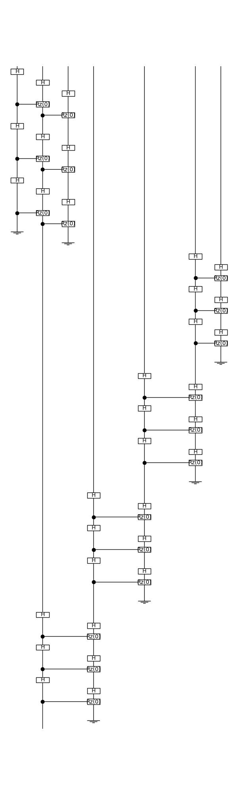

# tally

Tally is a tool for the quantum-enhanced composition of generative art.

See [Tally α](notebooks/tally-alpha.ipynb), the notebook of our first experiment.

## Composition as diagram

```python
from tally import H, V, e

composition = V(e, e, e) | e & H(e, e & e)

composition.draw()
```


```python
composition.to_diagram().draw()
```


## Composition as circuit

```python
from tally import functor, n_params

F = functor(n_params * [0])
F(composition.to_diagram()).draw()
```


